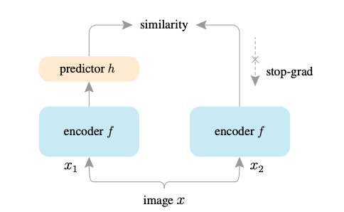

# Exploring Simple Siamese Representation Learning
<div align=middle>

*SimSiam architecture*
</div>

## SimSiam Pseudocode
```python
# f: backbone + projection mlp 
# h: prediction mlp
for x in loader: # load a minibatch x with n samples
  x1, x2 = aug(x), aug(x) # random augmentation
  z1, z2 = f(x1), f(x2) # projection, n-by-d
  p1, p2 = h(z1), h(z2) # predictions, n-by-d

  L = D(p1, z2)/2+D(p2,z1)/2 # loss

  L.backward() # back-propagate
  update(f, h) # SGD update

  def D(p,z): # negative cosine similarity
    z = z.detach() # stop gradient

    p = normalize(p, dim=1) #l2-normalize
    z = normalize(z, dim=1) # l2-normalize
    return -(p*z).sum(dim=1).mean()
 
```

## Usage

```
import torch
from SOTA_SSL_Models import SimSiam
from torchvision import models

model = SimSiam(args)

```

## Notes

* I found that using SimCLR augmentation directly will sometimes cause the model to collpase. This maybe due to the fact that SimCLR augmentation is too strong.
* Adopting the MoCo augmentation during the warmup stage helps.

## Dataset

```
data/
  imagenet/
    train/
      ...
      n021015556/
        ..
        n021015556_12124.jpeg
	..
      n021015557/
      ...
    val/
      ...
      n021015556/
        ...
	ILSVRC2012_val_00003054.jpeg
	...
      n021015557/
      ...
```

## Stages

### Pretraining

### Linear Evaluation Protocol

### Semi-Supervised Learning
use imagenet subset from https://github.com/tensorflow/datasets/tree/master/tensorflow_datasets/image_classification

### Transfer Learning

## Dependency
* I use python3 (3.5.2) and python2 is not supported. 
* I use PyTorch (1.1.0), though tensorflow-gpu is necessary to launch tensorboard.

## Install

```
git clone --recurse-submodules (this repo)
cd $REPO_NAME/code
(use python >= 3.5)
pip3 install -r requirements.txt
```

### When using docker

build & push & run

```
sudo ./setup-docker.sh
```

directory structure

```
/home/
 /code/
 /data/
```

## Data Folder Structure

```
code/
 cli.py : executable check_dataloading, training, evaluating script
 config.py: default configs
 ckpt.py: checkpoint saving & loading
 train.py : training python configuration file
 evaluate.py : evaluating python configuration file
 infer.py : make submission from checkpoint
 logger.py: tensorboard and commandline logger for scalars
 utils.py : other helper modules
 dataloader/ : module provides data loaders and various transformers
  load_dataset.py: dataloader for classification
  vision.py: image loading helper
 loss/ 
 metric/ : accuracy and loss logging 
 optimizer/
 ...
data/
```

### Functions

```
utils.prepare_batch: move to GPU and build target
ckpt.get_model_ckpt: load ckpt and substitue model weight and args
load_dataset.get_iterator: load data iterator {'train': , 'val': , 'test': }
```

## How To Use

### First check data loading

```
cd code
python3 cli.py check_dataloader
```

### Training

```
cd code
python3 cli.py train
```

### Evaluation

```
cd code
python3 cli.py evaluate --ckpt_name=$CKPT_NAME
```

* Substitute CKPT_NAME to your preferred checkpoint file, e.g., `ckpt_name=model_name_simclr_ckpt_3/loss_0.4818_epoch_15`

## Results

## Contact Me

To contact me, send an email to sally20921@snu.ac.kr
